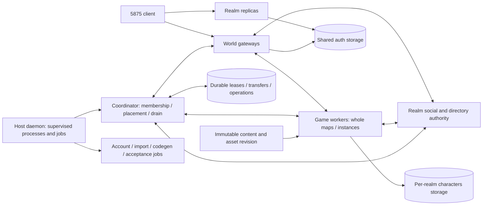

# Clustered runtime design — M15

Status: researched design and implementation plan, requested 2026-10-03;
module/process direction approved by the developer on 2026-10-03.
Implementation tracking belongs to the single [roadmap worklist](ROADMAP.md#m15-clustering-worklist).
This tranche changes documentation; no cluster processes or transport are shipped.
The inventory below was checked against integration source
`e06d4e468118454d906c1d4be8914a3522106d1b`. The constraint bullets on sessions,
maps and instances, ID allocators, write queues and far transfer were re-read
against `c3dea16292756e146df0ddd0783f97fee734dd5c` for M15.0 (see the
[M15.0 scope record](integration/cluster-m15-0.md) and the
[transfer-state inventory](integration/cluster-transfer-state.md)); the rest remain at
the older pin.

## Decision and reference comparison

Build an independent .NET 10/gRPC design with stable client gateways, one owner
per map/instance, realm-wide social services and durable ownership fencing.
Keep the current local realm/world mode and use the same simulation and protocol
implementations in both modes. This combines the useful parts of the references
without inheriting their incomplete guarantees or copying their implementation.

| Pinned reference | Useful evidence | Qualification and ArcaneCore consequence |
|---|---|---|
| [Krilliac/MangosSharp, cluster-proxy branch](https://github.com/Krilliac/MangosSharp/tree/8ead94388a1c3fa9de6bc16982214c804b9eeeb2) | Separated world/proxy topology, supervisor, federation and shard contracts | Disconnect handling and foreign-shard routing remain incomplete; reconnecting to another realm is not transparent handoff. Source review also suggests startup can await a registration reply before the receiving loop starts. That ordering concern is an inference, not an executed failure. Require actual separated-process registration and readiness tests. |
| [Krilliac/server-Zero](https://github.com/Krilliac/server-Zero/tree/e051334e4cccb6c712ce5b6feda7ad2aefb8e81a) | `src/ipc` and standalone `src/modules/AhWorker`: bounded queues, world-thread application, per-spawn generation fencing, readiness/health, recovery and idempotency | This is supervised auction-service offload of one child, not distributed map ownership. Apply its lifecycle principles to every ArcaneCore worker and durable mutation. |
| [SparkEngine active release-readiness source](https://github.com/Krilliac/SparkEngine/tree/b656f435025ff3896b7eba5337e4202e421f4579) | Separate server, gateway, daemon, orchestrator, collaboration, cooker, worker and automation roles; `AreaHandoffDispatcher` and `TFHandoffParticipant` capture/suspend/install/retire gameplay and fence residency | Active online-services specification retains same-host/same-user gateway and single-host daemon boundaries, with production services unsupported. `TFDatabase` uses an atomic JSON file and same-host locks. Preserve actual handoff phases, and implement distributed ownership/storage explicitly. UDP ticket binding is unrelated to the unchanged 5875 TCP client protocol. |
| [SparkEngine default Working source](https://github.com/Krilliac/SparkEngine/tree/2b03dc7971488b003beb97b965207c1b5d3cde49) | Earlier executable and local area-control split | Its control path persists session/epoch/phase without full gameplay transfer; older conceptual migration and wiki balancing claims cannot establish active-branch capability. Launch health and stop signals do not establish gameplay readiness or completed drain. |

The selected foundation is ArcaneCore's own authoritative tick and data seams.
Sharp informs topology; Zero informs lifecycle and idempotency; Spark's active
branch informs process roles and transactional handoff phases. A wholesale port
would leave the hard ownership, persistence and recovery problems unresolved.
GPL references supply behavior and architecture observations only.

The primary comparison paths are Sharp's
[supervisor](https://github.com/Krilliac/MangosSharp/blob/8ead94388a1c3fa9de6bc16982214c804b9eeeb2/src/server/Mangos.Cluster/Supervision/WorldSupervisor.cs)
and [shard registry](https://github.com/Krilliac/MangosSharp/blob/8ead94388a1c3fa9de6bc16982214c804b9eeeb2/src/server/Mangos.Cluster/Federation/ShardRegistry.cs),
Zero's [worker supervisor](https://github.com/Krilliac/server-Zero/blob/e051334e4cccb6c712ce5b6feda7ad2aefb8e81a/src/ipc/WorkerSupervisor.cpp)
and [durable custody](https://github.com/Krilliac/server-Zero/blob/e051334e4cccb6c712ce5b6feda7ad2aefb8e81a/src/game/AuctionHouseBot/CustodyService.h),
and Spark's active [online-services specification](https://github.com/Krilliac/SparkEngine/blob/b656f435025ff3896b7eba5337e4202e421f4579/docs/specs/online-services.md),
[handoff contract](https://github.com/Krilliac/SparkEngine/blob/b656f435025ff3896b7eba5337e4202e421f4579/SparkEngine/Source/Engine/Networking/AreaHandoffParticipant.h),
[game participant](https://github.com/Krilliac/SparkEngine/blob/b656f435025ff3896b7eba5337e4202e421f4579/GameModules/SparkGameMMOFPS/Source/Net/TFHandoffParticipant.cpp)
and [migration test](https://github.com/Krilliac/SparkEngine/blob/b656f435025ff3896b7eba5337e4202e421f4579/Tests/TestTF120Migration.cpp).
That Spark test uses actual participants/storage with a pawn capture/install
test double; it is not live cross-host acceptance. Zero map threads remain local
and its AH service is a single loopback child. Sharp map routing does not supply
complete instance/epoch authority. Same-realm clustering and federation are
separate: shared auth or cross-realm discovery does not move a character or its
client transparently between realms. Federation is outside M15's first phases.

Internal transport will use versioned protobuf contracts over ASP.NET Core gRPC.
Its [HTTP/2 and TLS requirements](https://learn.microsoft.com/en-us/aspnet/core/grpc/aspnetcore?view=aspnetcore-10.0)
and [deadline behavior](https://grpc.io/docs/guides/deadlines/) inform deployment
and cancellation tests. Package versions are selected and pinned when the first
transport phase is implemented. Local mode retains an in-process implementation
of the same semantic contracts.

## Current executable and state boundaries

| Existing component | Actual responsibility | Planned cluster role |
|---|---|---|
| `ArcaneCore.Realm` | SRP6 and realm-list TCP daemon; successful proof stores the account session key | Replicated realm frontend; each SRP connection remains on one replica until complete; advertise stable gateway addresses |
| `ArcaneCore.World` | World authentication, character screen, socket/cipher, all simulation/features and persistence queues | Keep combined local mode; extract gateway and game-worker hosting around shared implementation |
| Kernel / Cryptography / Protocol / Game / Data | Shared assemblies and store/simulation seams | Remain shared libraries; process separation does not turn each library into a network service |
| `ArcaneCore.AccountTool` | Short-lived create/password/security/list operations against auth storage | Administrative job with the same CLI; coordinate credential/session invalidation and schema readiness |
| `tools/spell-import` | Short-lived DBC-to-world replacement operation | Exclusive content-maintenance job that publishes an immutable content revision |
| `ArcaneCore.MockClient` | Synthetic owned-loopback acceptance executable using actual realm/world services | Test/job role; extend to launch and validate owned subprocesses as cluster phases land |
| `tools/codegen/gen_wow_tables.py` | Offline generated protocol/update-field tables | Build job producing reviewed, versioned artifacts; never a live simulation service |
| `CreatureDumpImporter` | Data library currently exercised by tests | Use the same coordinated maintenance job rules when an actual importer executable is introduced; the roadmap's ContentImporter path is aspirational today |

Relevant existing boundaries are [world session](../src/ArcaneCore.World/Net/WorldSession.cs),
[player session seam](../src/ArcaneCore.Game/Maps/IPlayerSession.cs),
[runtime](../src/ArcaneCore.Game/Maps/WorldRuntime.cs),
[database split](../src/ArcaneCore.Data/DatabaseOptions.cs), and
[feature lifecycle](../src/ArcaneCore.World/Features/WorldFeatures.cs).
The public realm/world TCP defaults remain 3724/8085.

Important current constraints:

- `WorldSession` combines TCP/cipher, scoped stores, settings, runtime and Player.
  Duplicate-account replacement in `SessionRegistry` and character online checks
  are process-local. The world-auth server-ID field is currently discarded;
  it cannot be trusted as a new routing authority.
- Maps are keyed by `(map ID, instance ID)` (`WorldRuntime._maps`,
  `WorldRuntime.cs:20,191-201`) and all run on one `WorldRuntime` thread. Mutable
  visibility, grids, objects and queues contain direct references. `InstanceRegistry`
  no longer exists: `InstanceManager` gives each instance its own Map. Instance IDs
  come from a process-local counter, group binds and instance contents (deaths,
  respawns, boss state) are memory-only, and only instance saves and character binds
  are durable ([instances.md](integration/instances.md)). Durable instance IDs and
  binds must be implemented before placing instances on other workers.
- Auth storage is shared across realms; characters storage is explicitly one
  database per realm; world content is read-only during runtime. Character and
  social rows have no realm discriminator. Keep per-realm characters databases
  initially and carry an explicit realm identity in configuration and contracts.
- Item GUIDs are seeded from database maximum then allocated locally; guild
  IDs use local maximum-plus-one, group IDs a local counter from 1, instance IDs a
  local counter from 101, and mail/auction/item-text IDs are seeded from stored
  maxima at attach. Concurrent allocators require durable authority or reserved
  disjoint ranges.
- Core state/inventory save together, but quest, spellbook, spell-state, social,
  reputation and instance writes each use a separate queue or barrier. Local
  revisions and FIFO ordering provide no distributed fencing. The core and quest
  queues retain a snapshot that fails three attempts and report it at flush, login or
  stop, but the caller of an ordinary enqueue is never told. The reputation queue now
  retains a failed write per character and retries it at the next write, login barrier
  or logout ([reputation.md](integration/reputation.md)); the social and instance
  queues still drop a write after three failed attempts
  ([table](integration/cluster-transfer-state.md#1-what-reaches-storage-and-when)).
  Recoverable acknowledgements and a complete handoff barrier are prerequisites.
- Social context, name cache, groups, guilds and channels refer to local players.
  A fleet must have one realm-wide social authority and routed presence.
- Far transfer retains direct source-map references and has no distributed
  deadline/recovery journal. Spell auras/casts survive local detachment without
  full durable persistence. Cooldowns, corpses and respawns use process-local
  clocks. `Player.CreateSnapshot` is not a complete handoff serialization.

## Target roles and placement

The names below describe proposed process roles, not projects already present.

| Authority / classification | Owns | Placement rule |
|---|---|---|
| Realm frontend — replica | SRP exchange and realm list; no live Player or exclusive durable partition | Multiple replicas sharing auth; connection-local SRP state requires affinity until completion |
| World gateway — partitioned single writer | Client TCP, rolling cipher, connection generation, account settings, character-screen flow and one ordered client-output stream | Stable address per realm; multiple gateways claim account sessions durably |
| Game worker — partitioned single writer | Map/instance tick, visibility, combat, creatures, movement, spells, inventory and quest state for its resident players | One writer per `(realm, map, instance)`; initially whole maps and statically assigned instances |
| Realm social/directory — partitioned single writer | Names, online presence, whisper/group/guild/channel routing and social mutation order | One fenced active authority per realm initially, recoverable from durable state |
| Coordinator — elected coordinator | Membership incarnations, readiness, placement, lease/transfer decisions and draining | One elected lease holder backed by transactional storage; replacement coordinators reconstruct decisions |
| Host daemon — per-host supervisor | Launch/monitor/drain approved role executables and short-lived jobs; resource limits | One supervisor per host; host-local process control, network control-plane client |
| Account/import/codegen/mock tools — distributed jobs or offline tools | Existing bounded CLI operations and reviewed result artifacts | Scheduled against compatible hosts with explicit job ownership; retain direct offline CLI usage |

A worker may own several maps on its existing tick thread. Placement considers
tick latency, queued work, players, memory, content availability and configured
host capacity; a hashing choice cannot override capacity or compatibility.
Start with explicit assignment, then automatic placement of new/empty maps.
Live map relocation follows complete snapshot/recovery tests. Splitting a
continent into cells requires a separate design for border interactions and
visibility; it is outside the first clustering phases.

Combat, movement, AI, spells and visibility stay together inside the map owner.
Do not create an RPC per gameplay subsystem or per object. Additional economy
services need a real consumer and custody/transaction design before extraction.

### Subsystem separation and alternatives

Every subsystem keeps a clean module boundary. The chosen executable boundary
follows mutable-state ownership. Approval of this planning direction keeps the
implementation phases and deployment gates below intact.

| Subsystem | Recommended execution | Reason and later extraction condition |
|---|---|---|
| Maps, movement and visibility | Same authoritative map/instance worker | A move changes grid membership, observers, range checks and update fields in one tick; remote ownership requires an explicit border/transfer protocol |
| Spells and combat | Same worker as their entities | Casts read position/targets and change health, threat, auras and death; per-cast RPC adds latency and uncertain partial effects |
| NPC processing and immediate AI | Same map worker, separate modules | Selection, interaction range, faction reactions, combat and inventory/quest effects must use current authoritative state |
| Say/yell/proximity emotes | Same map worker | Delivery depends on current visibility, position and faction rules |
| Whisper, guild, party/raid and channels | Realm social authority with routed presence/output | Cross-worker membership and delivery require one mutation order and deduplicated events; group combat calculations consume versioned membership on the map owner |
| Heavy path planning or model inference | Optional bounded compute worker after a measured consumer exists | Return proposals tagged with request, map/instance, owner epoch, entity state version, content/navigation revision and deadline; owner validates current state and applies or discards them |
| Economy operations | Optional justified service after transactional custody is designed | Preserve item/currency custody and idempotent operation outcomes; ordinary NPC gameplay ownership stays on the map |

Keeping one combined World executable is simplest to operate and remains the
compatibility mode, but cannot spread map CPU across hosts. Whole-map workers
preserve deterministic interactions and failure isolation, at the cost of
handoff and realm-wide routing. A movement/spell/NPC/AI executable split offers
independent scheduling but puts RPC on nearly every interaction, multiplying
tick latency, snapshots and partial-failure recovery. Use the whole-map design
first; split expensive pure computations only when profiling justifies it.
Compute responses never mutate world state directly, block the tick, or retain
authority after a worker/owner generation change. Timeout/backpressure falls
back to a documented local behavior or skips the proposal safely.

All roles publish realm, node incarnation, protocol/contract version, schema
compatibility and content/DBC/terrain manifest revision. Admission rejects a
mismatch. Replicas use the existing database engines; database replication and
multi-region gameplay are separate projects. Bound connection pools, worker
count and job concurrency per host before enabling automatic placement.

## Internal contracts and routing

Implement contract families only in the phase with their first consumer:

| Family | Required semantics |
|---|---|
| Membership/readiness/drain | Versioned role registration; unique incarnation; heartbeat distinct from gameplay readiness; stop admission, drain acknowledgement and final stop |
| Placement/ownership | Explicit realm/map/instance and character/account scopes; atomic claim/renew/release; monotonically increasing fencing epoch; authoritative owner lookup |
| Session input/output | Connection/session generation, character identity, owner epoch and ordered sequence; bounded plaintext opcode/payload; precise close/logout; backpressure and cancellation |
| Transfer | Unique transfer ID; source/target epochs; captured state revision; prepare/install/commit/retire/abort results; durable status lookup after ambiguous responses |
| Persistence | Operation ID, character/realm, owner epoch and save sequence; durable acknowledgement; idempotent retry and feature-complete flush result |
| Social/directory | Membership/presence version; sender authorization; deduplicated events and routed output; name creation/deletion invalidation |
| Jobs/content | Approved executable/job type, input manifest, bounded resource budget, status/result artifact and content-maintenance lease |

The gateway decrypts client headers and forwards plaintext messages. A worker's
session adapter posts input onto the authoritative tick and returns packets to
the gateway; game code never runs in an RPC callback. Keep one output sequencer
and cipher writer per client. Output from social and simulation must carry its
session generation and preserve logout/transfer causality. Old workers cannot
send to a replacement session. Never serialize a socket, DI scope, Player,
Map reference or cipher state into a handoff.

Keep existing opcode payload bounds, session-state validation, client ownership
checks and slow-client limits. Add independent bounds for internal messages,
mailboxes, in-flight RPCs and retained retries. Use unary calls for bounded
control/acknowledgements and ordered streams for session traffic. Set deadlines;
retry only operations with an idempotency key or a read-only result. Preserve
uncertain mutation outcomes until their durable operation status is known.
Authenticate internal roles and authorize their realm/role scope. Cross-host
endpoints use TLS; any loopback development exception is explicit configuration.

Start the receiving loop before registration can await a reply. Mark a role
ready only after schema validation, current leases, matching content manifests,
required feature queues and directories, and a real command roundtrip through
the running simulation. Health reports liveness separately. A dropped internal
transport reconnects with a new stream generation and reconciles durable
ownership; process restart creates a new incarnation. A stale stream cannot
resume by assumption.

## Persistence, handoff and failure recovery

Use transactional storage as the initial ownership authority. Every durable
mutation checks the current owner epoch in the same transaction as its write;
sequence checks reject old saves. A lease alone is insufficient if storage
still accepts an old owner's queued snapshots. Local monotonic lease budgets
stop admission/output when renewal becomes uncertain; durable epochs and
gateway routing reject stale authority. Test clock skew, partitions and expired
leases. Do not operate a partitioned worker indefinitely in autonomous mode.

Keep realm map/character/social ownership and transfer records in that realm's
characters database, alongside the writes they fence. Auth generation belongs
in the shared auth database. A coordinator's global view is a projection of
these authorities; it cannot replace an atomic per-realm ownership check.
Changes spanning auth and characters storage require the documented durable
operation/outbox and reconciliation, rather than an assumed cross-database
transaction. Node identity is stable configuration; incarnation changes on a
process restart and stream generation changes on reconnect.

Reserve item/group/guild ID ranges durably with overflow checks. Preserve current
client GUID layouts. Creature/instance routing includes the map-instance scope;
persisted IDs and instance bindings need stable allocation across restarts.
Give account session replacement a durable generation so two gateways cannot
both activate the same account/character in a realm. Credential changes invalidate the
defined generations consistently across realm and gateway replicas.

Refactor persistence barriers to cover core/inventory, quests, spellbooks and
social state relevant to the player. Save results report durable success or a
recoverable failure. For cross-feature updates in one characters database,
commit the required bundle atomically; use a durable operation/outbox where an
update spans authorities. Local caches remain valid only for their owner epoch.
Restart recovery reads persisted revisions, unresolved operations and transfers
before advertising readiness. State acknowledged as durable must survive
process loss; transient movement after the last checkpoint has a measured,
documented recovery window rather than an implied zero-loss guarantee.

Cross-worker map transfer preserves the existing vanilla far-teleport packets:

1. Reserve compatible destination capacity and persist a unique transfer record.
2. At a source tick boundary, suspend the player and fence further mutation.
   Capture a versioned complete state bundle and durably flush accepted changes.
3. Install a passive target using the transfer ID. Validate state/content and
   rebase remaining-duration timers; target simulation/output stays inactive.
4. Gateway emits existing transfer/new-world staging once and routes the matching
   world-port acknowledgement through the transfer, with bounded input buffering.
5. Atomically commit residency/epoch and the transfer decision. Target activation
   and gateway route change use that committed decision; retire source authority.
6. Rebuild visibility and send the existing before/after-add packet sequence.
   A timeout or failed reply queries durable status; abort only while the source
   remains authoritative. A committed transfer cannot roll back into two owners.

The state bundle includes identity/security generation, movement and counters,
inventory, journal/objective/timer state, spellbook/cooldowns/auras and supported
casts, played time, logout/transfer state, home bind and relevant social versions.
Preserve source-map corpse/reclaim ownership and vanilla combat-detachment rules.
Encode timer durations/reference timestamps explicitly, covering offline quest
expiry and process clock differences. A feature without capture/install/recovery
support blocks remote handoff; unsupported state cannot be silently discarded.
Introduce transfer participation alongside the first actual handoff consumer;
login/logout hooks alone do not cover it.

On worker loss, gateways stop routing, reject late outputs and disconnect clients
whose transient state cannot be recovered safely. Reconnect uses the current
durable epoch/checkpoint, resolves transfers, and retains acknowledged quest/item
operations. Gateway loss requires a normal client reconnect: a new gateway does
not inherit a live TCP connection or rolling cipher. Coordinator loss permits
only existing still-valid leases; replacement reconstructs placement and pending
transfers. Social loss invalidates presence and recovers the fenced authority.
No failure path acknowledges a dropped save as successful.

Graceful drain is a separate protocol: stop new placement/login/jobs; complete or
resolve transfers; evacuate supported residents or perform normal logout; flush
all feature queues; release leases; acknowledge drain; then terminate the owned
process. A launch, heartbeat, or signal alone is not readiness or completed drain.

## Phased implementation and acceptance

The roadmap owns phase status. The technical closure criteria are:

| Phase / lane owner | Concrete implementation | Required closure |
|---|---|---|
| M15.0 — integration/data owner | Inventory feature transfer state; separate connection/simulation responsibilities around existing seams; design and implement durable epochs, ID reservation, save acknowledgement/recovery and coordinated schema initialization | Existing local behavior and mock remain green; concurrent claims, old-owner saves, ID allocation and exhausted write retries have meaningful tests on SQLite/MariaDB/PostgreSQL |
| M15.1 — transport/session owner | Versioned contracts, gateway hosting and one separate game worker; retain combined World hosting and a local contract adapter; realm replicas and account-generation claims | Real owned subprocess registration/receive loop/readiness; actual SRP/M2/world cipher; two gateways replace duplicate sessions consistently; one-worker mock lifecycle remains equivalent |
| M15.2 — realm services/game owner | Routed identity/presence/social authority; scoped feature registration; true distinct Map instances and durable instance bindings | Cross-gateway social delivery and logout ordering, concurrent names/group/guild IDs, isolated instances, restart recovery and all existing feature tests |
| M15.3 — transfer/game/data owners | Complete feature state capture/install, durable transfer decisions, fenced residency, deadlines and acknowledgement routing; static multiple-worker map placement | Seamless 5875 TCP connection across workers; quests/timers, inventory, casts/auras/cooldowns and corpse semantics preserved; duplicate/lost/reordered/late messages and crashes at every handoff stage cannot activate two owners |
| M15.4 — operations/recovery owner | Host daemon/coordinator supervision, distinct readiness/drain, capacity admission, restart reconciliation and placement of new/empty maps; live map relocation only after complete map snapshots | Kill only fixture-owned subprocesses at defined stages; coordinator/worker/gateway/social/storage partitions, cold starts, drains and constrained-host overload recover with bounded resources and measured data loss policy |
| M15.5 — tooling/compatibility owner | Job contracts for existing CLIs/import/codegen/mock, content revision rollout, mixed-version policy, upgrade/rollback runbook and cluster diagnostics | Offline tools retain CLI use; live content replacement is refused or coordinated; Windows/Linux and private cross-host tests; deterministic output artifacts; compatible rollout and safe local-mode rollback |

An integrator owns the shared contract/schema changes and final candidate.
Workers own bounded domains and submit reviewable commits; no concurrent edits
to protocol contracts, migration allocation or registration ownership. Implement
one phase with complete tests before scheduling the next. First code tranche is
M15.0, after the current mock milestone, rather than a fleet of empty executables.

## Compatibility, migration and operational evidence

Keep the build-5875 realm/world wire, generated tables, SRP and header cipher
unchanged. One realm advertises gateways, not map workers or a realm per shard.
First deployments keep one characters database per realm. Multiple realms
sharing a characters database would require a separate discriminator/uniqueness
migration across all feature tables before admission.

Current schema lineage is auth v2, characters/world v6. Allocate new contiguous
module versions only when their migrations are implemented and integrated.
One maintenance authority applies upgrades; serving nodes validate compatible
versions without racing DDL. Test fresh schemas, historical upgrades, preserved
rows and idempotence against all existing provider engines. Back up existing
databases and inspect conflicting draft lineages before any upgrade.

Roll out local ownership/persistence semantics first, then one gateway/worker in
an owned fixture, then multiworker static placement, then supervised private-host
acceptance. Keep old combined hosting deployable throughout. Rollback drains
cluster ownership and verifies no pending transfer/writes before local mode
claims the realm; additive schema compatibility must be explicit. Unknown schema
or contract versions fail admission. Never run old unfenced writers alongside
new cluster writers against the same characters database.

Automated evidence must include the existing full suite and mock, actual
separate-process startup, multi-gateway duplicate replacement, cross-worker
transfer, exhaustive transfer crash points, stale incarnation/epoch rejection,
durable mutation retries, social ordering, drained shutdown, content mismatch,
bounded queues and migration/provider cases. Record throughput, p95/p99 tick
time, gateway latency, queue bytes, database pool use, restart time and checkpoint
recovery window before setting placement thresholds. Logs correlate realm,
session generation, worker incarnation, transfer ID, epoch and operation ID;
credentials/session keys stay out of logs.

Later real-client acceptance uses two actual build-5875 clients for visibility,
movement, combat, social interaction, map transfer and reconnect. The current
user request defers that testing; synthetic CI establishes implementation
evidence and cannot mark the runtime playable or cluster acceptance complete.
